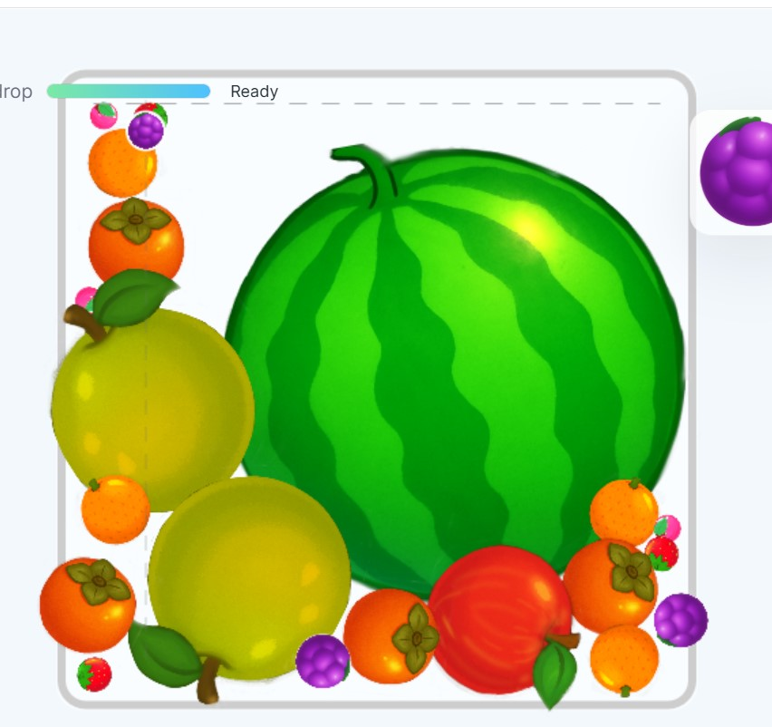

# 🍉 Suika — Physics Prototype
*A web-based fruit merge sandbox built by Zainab*
[Live at this site](https://zainabshujat.github.io/suika-lite)

  
*(Best experienced on desktop. Mobile version in progress!)*  

---

## 🎮 Overview
**Suika-Lite** is a browser-based recreation of the viral *Suika (Watermelon) Game*, built entirely with **HTML, CSS, JavaScript, p5.js**, and **Matter.js**.  

Drop fruits into a bowl, merge identical ones to evolve bigger fruits, and try to create the giant watermelon before the bowl overflows.  
It’s smooth, colourful, and powered by real physics — all handcrafted from scratch.  

---

## 🍊 Features
- ✨ Realistic 2D physics via Matter.js  
- 🍓 Seven fruit levels that merge up to the Watermelon  
- 💫 Soft, delayed-merge system for squishier feel  
- 💻 Desktop-first responsive UI  
- 📜 Merge chronology panel (track your merges!)  
- 💾 Local high-score saving  
- 🧩 Landing & Game Over overlays  
- 🎨 Custom fruit art designed and tuned by **Zee**

---

## 🧠 Tech Stack

| Layer | Library / Tool |
|:--|:--|
| Physics Engine | Matter.js |
| Rendering | p5.js |
| UI / Layout | Vanilla HTML + CSS |
| Persistence | `localStorage` |
| Hosting | GitHub Pages |

---

## 🕹️ Controls

| Action | Input |
|:--|:--|
| Drop fruit | Mouse click inside the bowl |
| Drop at center | Spacebar |
| Reset game | “New Game” button |
| Clear fruits | “Clear Fruits” button |

---

## 🌸 Developer Notes
This began as a weekend physics experiment to understand **collision dynamics, merge logic, and game feel** —  
but grew into a polished, standalone mini-game.

The next project, **Suika+**, will expand this with:
- Level-based goals & timed challenges  
- Coins and achievements  
- Unlockable cosmetic fruits  
- Full mobile optimization  

*(Hint: “Enjoying Suika-Lite? Click here for the free premium version 🍑” — coming soon!)*

---

## 🪄 Credits
**Built & designed by Zee**  
Sprites, physics tuning, and UI layout all hand-crafted 🍑  

> p5.js and Matter.js are open-source libraries.  

---

## 📎 License
Open for learning and inspiration.  
If you fork or remix, please credit **@zainabshujat**.

---

## 🌐 Links
🔗 [Play on GitHub Pages](https://zainabshujat.github.io/suika-lite)  
💌 [Connect on LinkedIn](https://www.linkedin.com/in/zainab-shujat-56b14928b/)  
📰 [Notes from a BTech Brain — newsletter](https://www.linkedin.com/newsletters/7319367808327303168/)

---

### 🍉 Suika-Lite • built-by-Zainab Shujat
